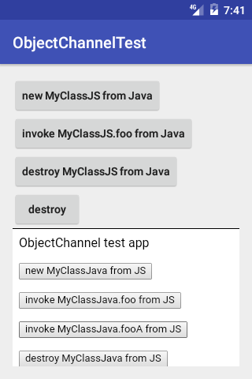

# <p align="center"></p>
ObjectChannelのAndroid用の実装を提供します。

## Example 
本リポジトリの [app](app) モジュールが, WebView(HTML) と ネイティブコード(Java) 間の ObjectChannel で相互に オブジェクト生成, メソッド実行, 破棄 をする簡単なサンプルになっています。



- Java: [MainActivity.java](app/src/main/java/jp/co/dwango/cbb/oc/test/MainActivity.java), [MyClassJava.java](app/src/main/java/jp/co/dwango/cbb/fc/test/MyClassJava.java)
- HTML: [index.html](app/src/main/assets/html/index.html), [script.js](app/src/main/assets/html/script.js), [data-channel.js](app/src/main/assets/html/data-channel.js), [function-channel.js](app/src/main/assets/html/function-channel.js), [object-channel.js](app/src/main/assets/html/object-channel.js)

## Setup 
### gradle
```
dependencies {
	compile 'jp.co.dwango.cbb:object-channel:2.0.2'
}
```

## Usage
#### step 1: ObjectChannelを準備
使用するFunctionChannelインスタンスを指定してObjectChannelを生成します。

```java
	ObjectChannel objectChannel = new ObjectChannel(functionChannel);
```

> DataChannel から FunctionChannel のレイヤを利用しない場合, DataBus と直結できる [`ObjectChannelWrapper`](object-channel/src/main/java/jp/co/dwango/cbb/oc/ObjectChannelWrapper.java) の利用を推奨します。
```java
	ObjectChannelWrapper objectChannel = new ObjectChannelWrapper(dataBus);
```

#### step 2: クラスを準備
- `ObjectChannel` でリモート側からインスタンス化されるクラスは `CrossBorderInterface` を `implements` してください
- リモート側から実行されるメソッドには, `@CrossBorderMethod` アノテーションを付与してください

例: [MyClassJava.java](app/src/main/java/jp/co/dwango/cbb/oc/test/MyClassJava.java)

```java
class MyClassJava implements CrossBorderInterface {
	// コンストラクタ
	public MyClassJava(String c) {
		Log.d("MyClassJava", "executing constructor(" + c + ")");
	}

	// 同期RPC
	@CrossBorderMethod
	public String foo(String a1, String a2, String a3) {
		return a1 + "," + a2 + "," + a3 + ":" + c;
	}

	// 非同期RPC
	@CrossBorderMethod
	public Promise<String> fooA(final String a1, final String a2, final String a3) {
		return new Promise<String>() {
			@Override
			public void run(final PromiseCallback<String> callback) {
				try {
					Thread.sleep(3000);
				} catch (InterruptedException e) {
					e.printStackTrace();
				}
				callback.onReturn(a1 + "," + a2 + "," + a3 + ":" + c);
			}
		};
	}

	// デストラクタ
	@Override
	public void destroy() {
		// 必要に応じて破棄処理を実装
	}
}
```

#### step 3: クラスを登録
step 2 で準備したクラスを `ObjectChannel#bind` で登録することで, リモート側からオブジェクト生成, メソッド実行, 破棄 ができるようになります。

```java
	channel.bind(MyClassJava.class);
```

#### step 4: リモート側がbindしているクラスのインスタンス化
`ObjectChannel#create` でリモート側が `bind` しているクラスのインスタンスを生成できます。

```java
	channel.create("MyClassJS", args, new RemoteObjectHandler() {
		@Override
		public void onResult(@Nullable RemoteObject object) {
			_this.object = object;
		}
	});
```

オブジェクトの生成が完了（または失敗）すると `RemoteObjectHandler#onResult` がコールバックされ, その引数にオブジェクトが指定されます。

#### step 5: リモート側のメソッドを呼び出す
`RemoteObject#invoke` で生成したオブジェクトのメソッドを呼び出すことができます。

```java
	JSONArray args = new JSONArray().put("a1").put("a2").put("a3");
	object.invoke("foo", args, new RemoteObjectResultHandler() {
		@Override
		public void onResult(Object result) {
			Toast.makeText(MainActivity.this, "result: " + result, Toast.LENGTH_SHORT).show();
		}
	});
```

戻り値が不要な場合は, `RemoteObjectResultHandler` の指定を省略してください。

#### step 6: リモート側のオブジェクトを破棄
`RemoteObject#destroy` でオブジェクトを破棄することができます。

```java
	object.destroy();
```

#### step 7: 破棄
`ObjectChannel#destroy` で, ObjectChannel を破棄できます

```javascript
	objectChannel.destory();
```

> - ObjectChannelをdestroyしても下位層（FunctionChannel, DataChannel, DataBus）のdestroyは行われません
> - ObjectChannelWrapperを使用している場合, コンストラクタで指定したDataBusを除きdestroyされます

## License
- Source code, Documents: [MIT](LICENSE)
- Image files: [CC BY 2.1 JP](https://creativecommons.org/licenses/by/2.1/jp/)
